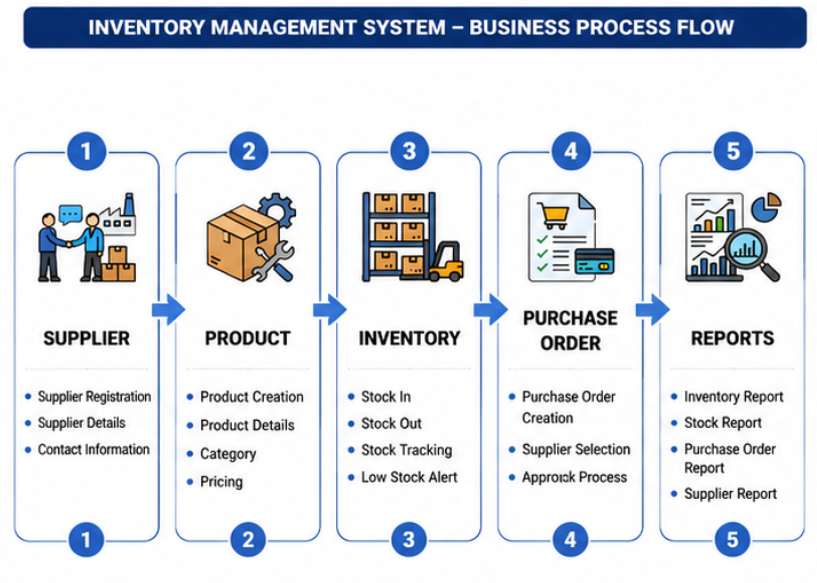
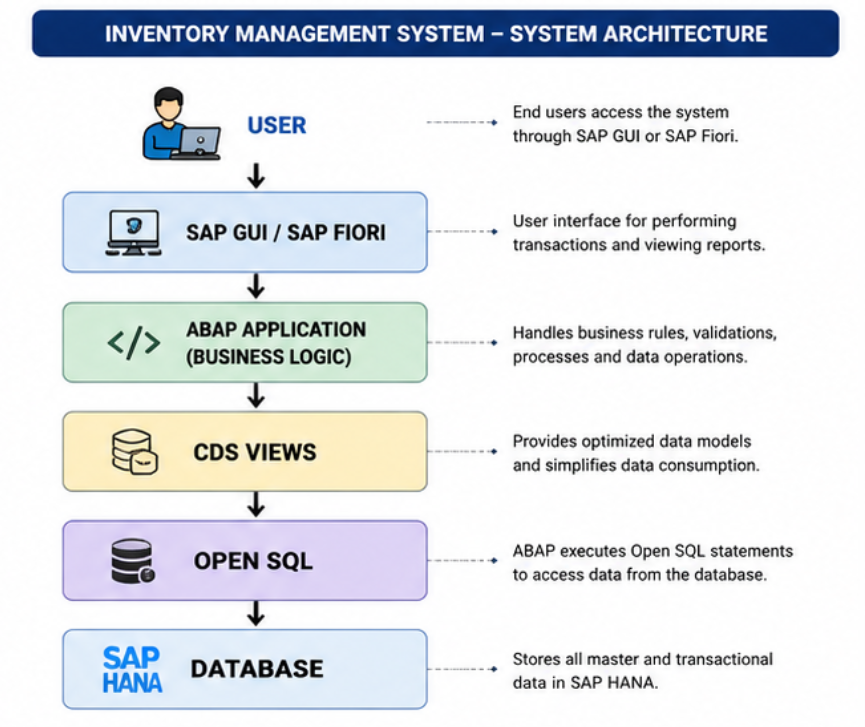
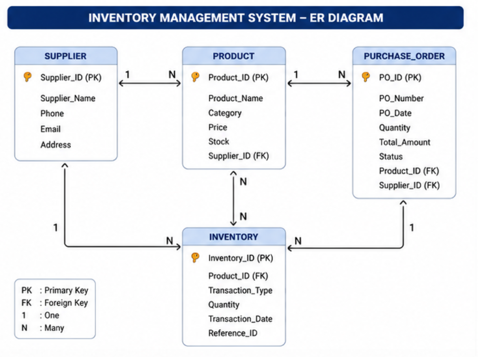
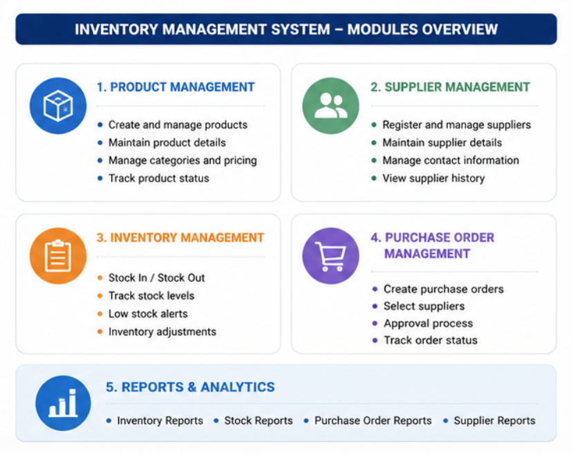

# Inventory Management System using SAP ABAP on HANA

## About the Project

This repository is my learning project for SAP ABAP Development for HANA. I created it after completing my SAP Certified Associate – Back-End Developer (ABAP Cloud) certification to understand how enterprise applications are designed using modern SAP technologies.

Since I currently do not have access to an SAP S/4HANA or SAP BTP system, this project focuses on the design, architecture, business process, database modeling, and SAP development concepts rather than a deployed implementation.

The project is based on a common business scenario where an organization manages products, suppliers, inventory, and purchase orders.

---

## Business Problem

Many organizations need an efficient way to manage inventory, monitor stock levels, and maintain supplier information.

An inventory management system helps businesses to:

- Store product information
- Manage supplier details
- Track inventory
- Create purchase orders
- Generate inventory reports

Modern SAP applications use SAP HANA to improve performance by optimizing database access and reducing unnecessary data processing.

---

## Objectives

The objective of this project is to understand:

- SAP ABAP on HANA architecture
- Inventory Management business process
- CDS View design
- Modern Open SQL
- ABAP Objects
- OData Services
- SAP application architecture

---

## Project Screenshots

### Business Process Flow



### System Architecture



### Entity Relationship Diagram



### Project Modules




---

## Technologies Studied

- SAP ABAP
- SAP HANA
- CDS Views
- Open SQL
- ABAP Objects
- OData Services
- Git
- GitHub

---

## Project Modules

### Product Management
- Add Product
- Update Product
- Delete Product
- Search Product

### Supplier Management
- Add Supplier
- Update Supplier
- Delete Supplier

### Inventory Management
- Stock In
- Stock Out
- Current Stock
- Low Stock Alert

### Purchase Order Management
- Create Purchase Order
- Approve Purchase Order
- Receive Goods

---

## Repository Structure

```
docs/
diagrams/
sample-code/
screenshots/
```

---

## Learning Goals

Through this project I aim to improve my understanding of:

- SAP ABAP Development for HANA
- CDS Views
- Open SQL
- Enterprise Application Design
- Business Process Design

---

## Author

**Harshini Chowdari**

SAP Certified Associate – Back-End Developer (ABAP Cloud)
