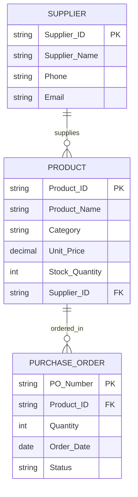

# Entity Relationship Diagram (ERD)

## Explanation

- One supplier can supply multiple products.
- One product can appear in multiple purchase orders.
- Each purchase order belongs to one product.
- Supplier information is stored separately to avoid duplicate data.
