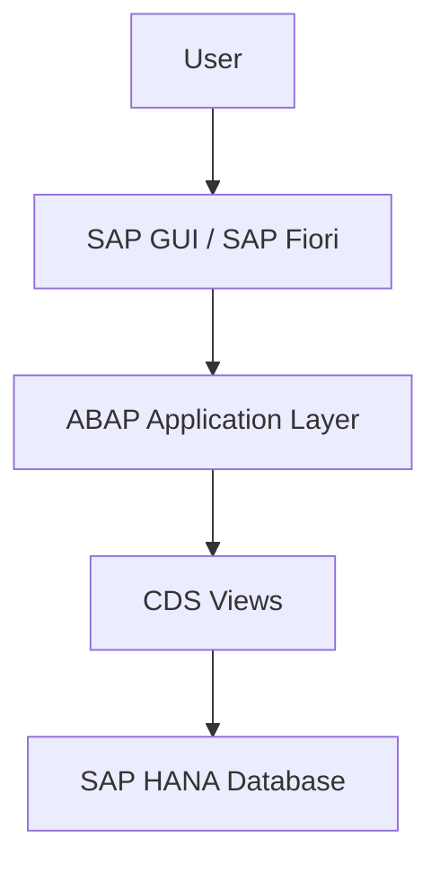

# System Architecture

## Description

The user interacts with the application through SAP GUI or SAP Fiori.

The ABAP application processes the business logic.

CDS Views provide optimized data access.

SAP HANA stores and processes business data efficiently.
